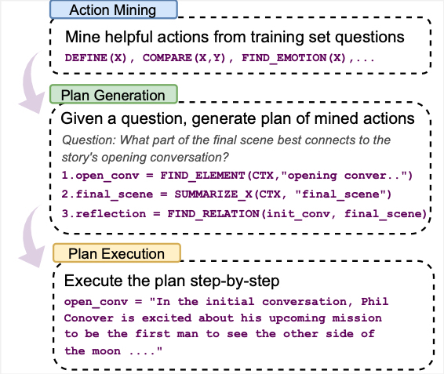

# PEARL

This is the repository for our paper "Prompting Large Language Models to
Plan and Execute Actions Over Long Documents".

# Pipeline

We introduce PEARL, a framework that combines Planning and Executable Actions for Reasoning over Long documents.

